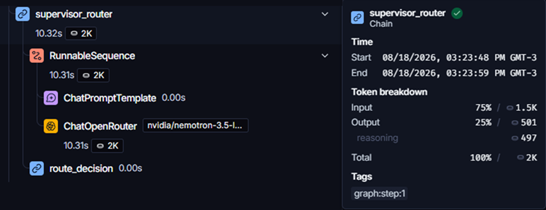
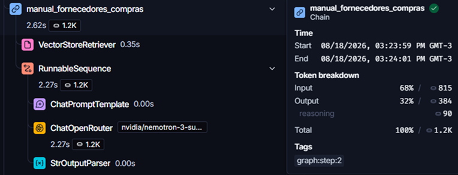
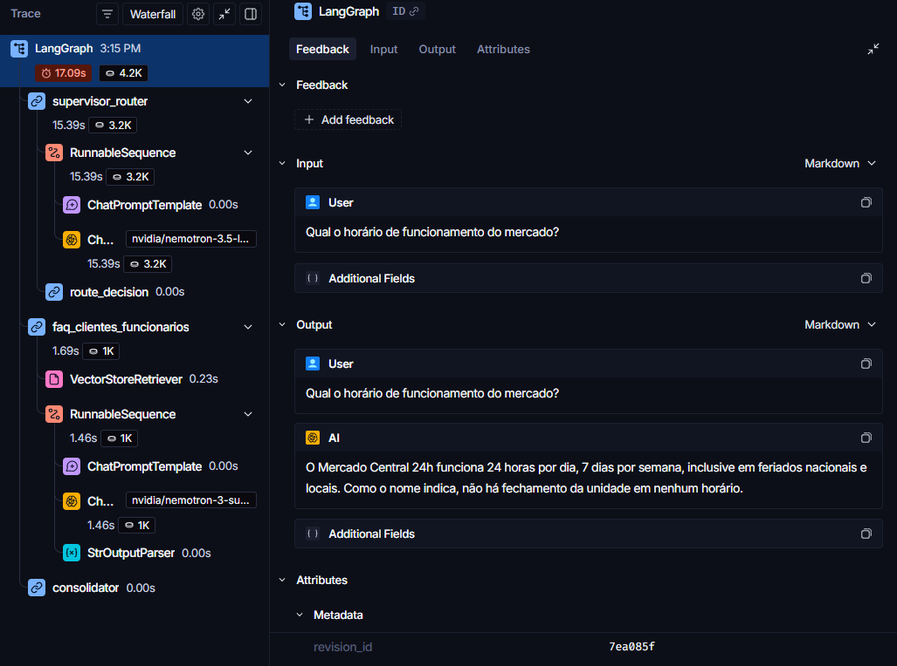
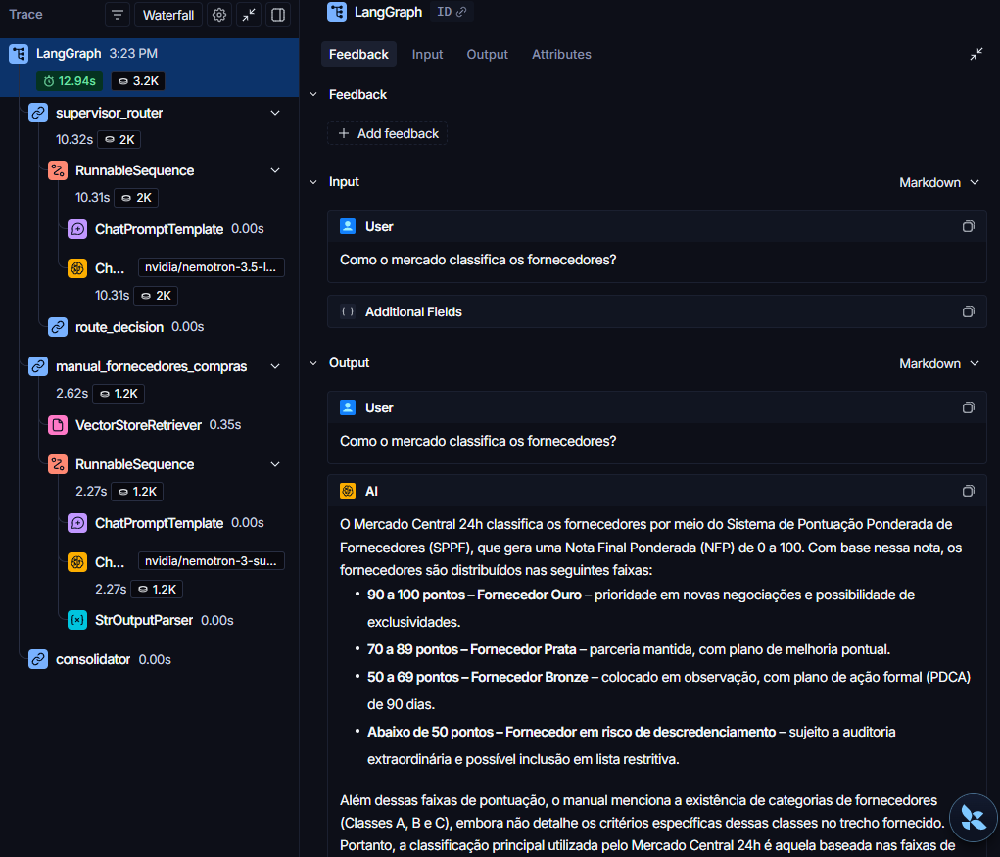
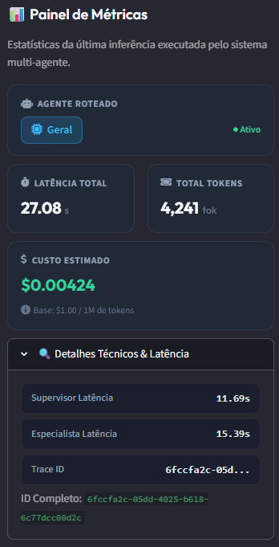
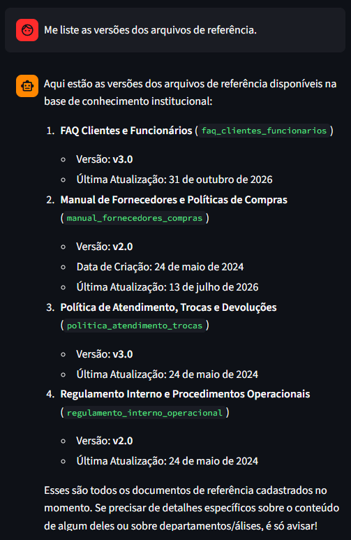
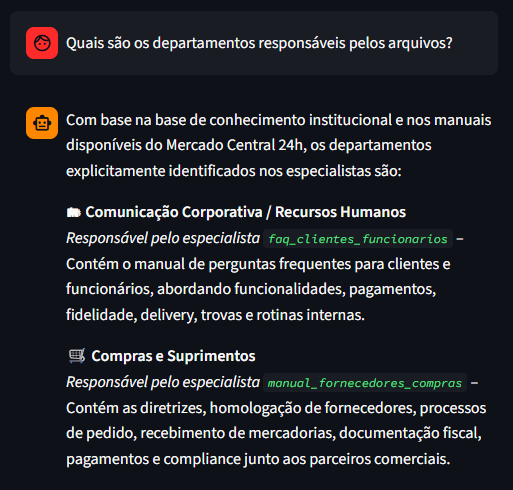

[](README_en.md)


<h1 align="center">Agente Supervisor-Especialistas: RAG Aplicado ao Atendimento do Mercado Central 24h</h1>

<h3 align="center">Entregável do Programa ONE - G10</h3>

<p align="center">
  
</p>

Em parceria com a <a href="https://www.alura.com.br/" target="_blank" rel="noopener noreferrer">Alura</a>, o <a href="https://www.oracle.com/br/education/oracle-next-education/" target="_blank" rel="noopener noreferrer">Programa ONE</a> proporcionou:

- **Nivelamento:** GitHub, Python aplicado, Fundamentos de IA e Machine Learning.
- **Agentes Autônomos e Automação com n8n**
- **Engenharia de IA e RAG com LangChain**
- **Oracle Cloud Infrasctructure (OCI):** disponibilização do projeto na nuvem.  

---

## 🎯 Objetivo

Construir um **Agente de IA** focado em **responder perguntas de colaboradores de um Mercado Central 24H** em relação a **diversos documentos** pertinentes no contexto da empresa.

O Agente está aberto a qualquer colaborador da empresa, sem necessidade de acesso restrito.

--- 
## 🌐 Aplicação Online

Acesso: [app.rsa.ia.br](https://app.rsa.ia.br)

---

## 🗂️ Estrutura do Projeto

```
RAG/
├── agents/
│   ├── specialist/
│   │   ├── __init__.py
│   │   └── base.py                       # Classe base dos agentes especialistas
│   └── supervisor/
│       ├── __init__.py
│       ├── agent.py                      # Agente Supervisor (roteador)
│       ├── models.py                     # Estruturas Pydantic (AgentSelection)
│       └── specialist_summaries.json     # Metadados e escopos para cada especialista
├── core/
│   ├── __init__.py
│   ├── protocols.py                      # Protocolo de Comunicação de Agentes (ACPMessage)
│   └── state.py                          # Estrutura do estado global (AgentState)
├── docs/
│   └── Mercado_Central_24h/              # Documentos PDF de base de conhecimento
│       ├── FAQ_Clientes_Funcionarios.pdf
│       ├── Manual_Fornecedores_Politica_Compras.pdf
│       ├── Politica_Atendimento_Trocas_Devolucoes.pdf
│       └── Regulamento_Interno_Procedimentos_Operacionais.pdf
├── faiss_index/                          # Índices FAISS gerados automaticamente
├── app.py                                # Interface gráfica em Streamlit (Entry Point)
├── config.py                             # Configurações globais, paths e modelos
├── indexing.py                           # Criação e carregamento dos índices FAISS
├── rag_multiagent.py                     # Definição do grafo de fluxo LangGraph
├── requirements.txt                      # Dependências do projeto
├── .env                                  # Chaves de API e configurações de ambiente
├── .env.example                          # Exemplo do conteúdo de .env
└── .gitignore                            # Arquivos ignorados pelo controle de versão
```

> O índice FAISS (`faiss_index/`) é gerado localmente e ignorado pelo `.gitignore`.

---

## 🏗️ Arquitetura

A arquitetura atual é baseada em um padrão **Supervisor-Especialistas** gerenciado pelo **LangGraph**:

1. **Agente Supervisor (`SupervisorAgent`):**

- Analisa a pergunta do usuário e decide para qual especialista direcionar a solicitação com base em resumos de escopo estruturados em `specialist_summaries.json`.
- Se a pergunta não se encaixar em nenhuma especialidade, ele direciona para um manipulador geral (`general`).
- Implementado usando o modelo [`nvidia/nemotron-3.5-lightning:free`](https://openrouter.ai/nvidia/nemotron-3.5-lightning:free) via OpenRouter.

2. **Agentes Especialistas (`SpecialistAgent`):**

- Cada especialista gerencia um índice vetorial (FAISS) criado a partir de um documento PDF específico.
- Eles realizam buscas semânticas locais (RAG) utilizando o modelo [`embed-multilingual-v3.0`](https://docs.cohere.com/docs/cohere-embed), via OpenRouter, e geram uma resposta focada.
- Implementados usando o modelo [`nvidia/nemotron-3-super-120b-a12b:free`](https://openrouter.ai/nvidia/nemotron-3-super-120b-a12b:free) via OpenRouter.

3. **Interface Streamlit (`app.py`):**

- Chat interativo que exibe o andamento da conversa e apresenta métricas em tempo real (latência, consumo de tokens e custo estimado).


---

## ⚙️ Pré-requisitos

- Python 3.11+
- `API Key` da OpenRouter e do Cohere
- Conta no [LangSmith](https://smith.langchain.com/) (opcional, mas recomendado para rastreamento)

---

## 🚀 Instalação e Uso

```bash
# 1. Clone o repositório
git clone <url-do-repositorio>
cd RAG

# 2. Crie e ative o ambiente virtual
python -m venv .venv
.venv\Scripts\activate      # Windows
# source .venv/bin/activate  # Linux/macOS

# 3. Instale as dependências
pip install -r requirements.txt

# 4. Configure as variáveis de ambiente
# Copie o arquivo .env.example e preencha com suas chaves em .env
cp .env.example .env

# 5. Coloque seus PDFs na pasta docs/
# (a estrutura de subpastas é carregada automaticamente pelo DirectoryLoader)
```

> ⚠️ **Nunca comite o arquivo `.env`!** Ele já está listado no `.gitignore`.

---

## 🧩 Modelos Utilizados

| Papel | Modelo | Onde roda |
|---|---|---|
| Chunking e Embeddings | `embed-multilingual-v3.0` | [Cohere](https://docs.cohere.com/docs/cohere-embed) |
| LLM principal (resposta) | `nvidia/nemotron-3-super-120b-a12b:free` | [OpenRouter](https://openrouter.ai/nvidia/nemotron-3-super-120b-a12b:free) |
| LLM supervisor (roteamento) | `nvidia/nemotron-3.5-lightning:free` | [OpenRouter](https://openrouter.ai/nvidia/nemotron-3.5-lightning:free) |

---

## 📊 Rastreamento com LangSmith

As seguintes imagens apresentam como o LangSmith registra a execução da cadeia de comandos. 

`Input/User`: A pergunta enviada pelo usuário.

`Output/AI`: A resposta retornada.



Nessa imagem, verifica-se o consumo de tokens do agente supervisor (`supervisor_router`) no _input_ e no _output_, o tempo de execução em cada etapa da sua cadeia e o modelo utilizado.



Já nessa imagem da cadeia do agente especialista (`manual_fornecedores_compras`) verifica-se também a etapa de recuperação das informações na etapa `VectorStoreRetriever`. O agente supervisor o invocou, a partir do contexto da pergunta recebida. 

As próximas imagens apresentam o fluxo completo da cadeia executada. 

**Exemplo 01:**



**Exemplo 02:**



O registro do LangSmith é uma grande vantagem para avaliação do projeto, entender claramente a rota de execução e os gastos (tempo e tokens) envolvidos.

---

## 📊 Painel de Métricas

Os parâmetros obtidos no LangSmith podem ser utilizados para apresentar uma métrica para o usuário. Dessa forma, é possível ter maior clareza dos gastos em cada requisição, bem como verificar qual agente foi o responsável pela entrega da resposta. 



---

## 📄 Base de Conhecimento

Os documentos utilizados pertencem a uma empresa fictícia chamada **Mercado Central 24h** e cobrem:

- FAQ de Clientes e Funcionários
- Manual de Fornecedores e Política de Compras
- Política de Atendimento, Trocas e Devoluções
- Regulamento Interno e Procedimentos Operacionais

O arquivo `specialist_summaries.json` foi criado a partir dos metadados e dos sumários desses arquivos para servir como referência de roteamento para o agente especialista. Adotei essa estratégia para evitar _prompts_ explicativos longos e assim reduzir gastos de tempo e de tokens no roteamento das tarefas. Ainda, os metadados contidos nesse `.json` também viabiliza curadoria dos arquivos `.pdf` de referência, como apresentado nestas imagens:

**Exemplo 01:**



**Exemplo 02:**



Essa estyratégia também é útil para o agente supervisor tentar responder perguntas genéricas, que são aquelas não encontradas no conteúdo dos arquivos. Se mesmo no arquivo `.json` não for encontrada a resposta, o supervisor retorna uma mensagem de desculpas ou orienta o usuário buscar mais informações em outras fontes, por exemplo, no site do mercado.

---

## 🌐 Deploy em Produção (Oracle Cloud Infrastructure)

A aplicação está publicada em produção no endereço **[https://app.rsa.ia.br](https://app.rsa.ia.br)**, hospedada em uma instância de computação (VM) na **Oracle Cloud Infrastructure (OCI)**.

### Arquitetura de Infraestrutura

```
Usuário → DNS (app.rsa.ia.br) → OCI (Security List + NSG) → Instância Ubuntu

├── iptables (firewall do SO) 
├── Nginx (reverse proxy + SSL) 
└── Streamlit (gerenciado via systemd, porta 8501)
```

- **DNS:** o subdomínio `app.rsa.ia.br` aponta para o IP público da instância OCI, enquanto o domínio principal `rsa.ia.br` permanece hospedado separadamente no GitHub Pages.
- **Rede OCI:** liberação de tráfego HTTP (80) e HTTPS (443) configurada na *Security List* da VCN e no *Network Security Group (NSG)* associado à instância.
- **Firewall do sistema operacional (`iptables`):** regras de `ACCEPT` adicionadas para as portas 80, 443 e 8501, persistidas com `netfilter-persistent`.
- **Nginx:** atua como *reverse proxy*, encaminhando as requisições recebidas em `app.rsa.ia.br` para a aplicação Streamlit rodando localmente na porta `8501`.
- **HTTPS:** certificado SSL gratuito emitido via **Let's Encrypt (Certbot)**, com renovação automática agendada (`certbot.timer`).
- **Persistência do Streamlit:** a aplicação é gerenciada por um serviço **`systemd`**, garantindo que ela inicie automaticamente com o sistema operacional e reinicie sozinha em caso de falha.

### Configuração do Nginx

- Arquivo: `/etc/nginx/sites-available/streamlit_app`

```bash
server {
    listen 80;
    listen [::]:80;
    server_name app.rsa.ia.br;

    location / {
        proxy_pass http://localhost:8501/;
        proxy_http_version 1.1;
        proxy_set_header Upgrade $http_upgrade;
        proxy_set_header Connection "upgrade";
        proxy_set_header Host $host;
        proxy_set_header X-Real-IP $remote_addr;
        proxy_set_header X-Forwarded-For $proxy_add_x_forwarded_for;
        proxy_set_header X-Forwarded-Proto $scheme;
        proxy_read_timeout 86400;
    }
}
```

> Após a execução do Certbot (`sudo certbot --nginx -d app.rsa.ia.br`), este arquivo é automaticamente atualizado com os blocos de `listen 443 ssl;` e o redirecionamento de HTTP para HTTPS.

### Serviço `systemd` do Streamlit

Configurei um serviço `systemd` para que o Streamlit inicie automaticamente sempre que a instância for reiniciada, e se reinicie sozinho em caso de falha.

- Arquivo: `/etc/systemd/system/streamlit.service`

```bash
[Unit]
Description=Streamlit App - Central Market Agent
After=network.target

[Service]
Type=simple
User=ubuntu
WorkingDirectory=/home/ubuntu/central_market_agent
ExecStart=/home/ubuntu/central_market_agent/.venv/bin/streamlit run app.py --server.port 8501 --server.address 0.0.0.0
Restart=on-failure
RestartSec=5

[Install]
WantedBy=multi-user.target
```

Após criar o arquivo, habilitei o serviço para iniciar junto com o sistema operacional e o inicializei:

```bash
sudo systemctl daemon-reload
sudo systemctl enable streamlit.service
sudo systemctl start streamlit.service
```

**Comandos úteis para manutenção:**

```bash
# Verificar status do serviço
sudo systemctl status streamlit.service

# Reiniciar o serviço manualmente
sudo systemctl restart streamlit.service

# Ver logs em tempo real
sudo journalctl -u streamlit.service -f

# Testar renovação do certificado SSL (simulação)
sudo certbot renew --dry-run
```

---

## 🔄 Atualizando a Instância OCI após Alterações no GitHub

Sempre que eu enviar novas alterações para o repositório no GitHub, preciso repetir o processo abaixo na instância OCI para que a aplicação em produção reflita a versão mais recente do código.

**Passo 1: Conectar via SSH à instância**

```bash
ssh ubuntu@<IP_da_instancia>
```

**Passo 2: Acessar a pasta do projeto**

```bash
cd ~/central_market_agent
```

**Passo 3: Buscar as atualizações do repositório**

```bash
git pull origin main
```

> Substituo `main` pelo nome da branch correta, caso utilize outra.

**Passo 4: Ativar o ambiente virtual**

```bash
source .venv/bin/activate
```

**Passo 5: Atualizar as dependências (caso o `requirements.txt` tenha mudado)**

```bash
pip install -r requirements.txt
```

**Passo 6: Reiniciar o serviço do Streamlit**

Como a aplicação é gerenciada pelo `systemd`, não preciso encerrar processos manualmente — basta reiniciar o serviço:

```bash
sudo systemctl restart streamlit.service
```

**Passo 7: Verificar se o serviço subiu corretamente**

```bash
sudo systemctl status streamlit.service
```

**Passo 8: Testar a aplicação**

Acesso `https://app.rsa.ia.br` no navegador e confirmo que as alterações foram aplicadas corretamente.


### Resumo rápido (comandos em sequência)

```bash
cd ~/central_market_agent
git pull origin main
source .venv/bin/activate
pip install -r requirements.txt
sudo systemctl restart streamlit.service
sudo systemctl status streamlit.service
```

---

## 🧩 Desafios

Durante a publicação da aplicação em produção na OCI, enfrentei uma sequência de bloqueios em diferentes camadas de rede e infraestrutura. Segue documentação do diagnóstico e a solução de cada um, na ordem em que foram identificados:

| # | Desafio | Diagnóstico | Solução |
|---|---|---|---|
| 1 | Conexão externa expirando (timeout) | Faltava regra de rota associada ao *Internet Gateway* na *Route Table* da VCN | Adicionada a rota `0.0.0.0/0 → Internet Gateway` |
| 2 | Conexão externa ainda expirando | *Network Security Group (NSG)* da instância sem regras de entrada para as portas 80/443 | Adicionadas regras de *ingress* liberando as portas 80 e 443 no NSG |
| 3 | Conexão local funcionando, mas externa bloqueada | `iptables` do sistema operacional permitindo apenas a porta 22 (SSH) para novas conexões | Adicionadas regras `ACCEPT` para as portas 80, 443 e 8501 no `iptables`, persistidas com `iptables-persistent` |
| 4 | Nginx exibindo página padrão em vez do Streamlit | Site `default` do Nginx ainda ativo, conflitando com a configuração do domínio | Removido o link simbólico `/etc/nginx/sites-enabled/default` |
| 5 | Nginx retornando 404 na raiz do domínio | Bloco `location` configurado para `/streamlit-app/` em vez da raiz `/` | Configuração ajustada para `location /`, alinhada à estratégia de subdomínio dedicado |
| 6 | Erro `502 Bad Gateway` | Processo do Streamlit não estava em execução (havia sido encerrado junto com a sessão SSH anterior) | Processo reiniciado, e posteriormente migrado para um serviço `systemd` para evitar o problema de forma definitiva |
| 7 | Comando `streamlit` não encontrado (`Exit 127`) | Ambiente virtual (`.venv`) do projeto não estava ativado na sessão do terminal | Ativação do `.venv` antes de iniciar a aplicação, e referência ao caminho absoluto do binário no serviço `systemd` |

Após a resolução completa dessa cadeia de causas, a aplicação passou a ser publicada com sucesso via HTTPS, com renovação automática de certificado e reinício automático em caso de falha ou reboot da instância.

---

## 🚧 Melhorias Futuras

Este projeto está em evolução contínua. Alguns pontos que pretendo endereçar nas próximas iterações:

- **Redução de latência no fluxo de fallback:** quando o Agente Supervisor não identifica um especialista adequado para a pergunta recebida, o tempo de resposta do fluxo geral (`general`) ainda está alto.
- **Evolução da estrutura de *harness* do projeto:** aprimorar a organização de testes, avaliação e validação do comportamento dos agentes.
- **Controle de uso dos modelos de LLM:** como a aplicação está publicada com acesso aberto, pretendo implementar mecanismos de limitação de uso (rate limiting) para preservar a sustentabilidade das chaves de API utilizadas.
- **Suporte a múltiplas chaves de API e seleção de modelos por usuário:** avaliar formas de permitir que diferentes usuários utilizem suas próprias credenciais e/ou modelos de LLM preferidos, ampliando a flexibilidade e a escalabilidade da solução.

---

## 📌 Histórico de Versões

- **v1.0** (2026/08/19): primeira versão publicada em produção, com deploy na OCI, HTTPS via Let's Encrypt, persistência via `systemd` e documentação completa do processo de troubleshooting e atualização.

---

## 📝 Licença

Projeto de estudo — com licença MIT. Uso livre para fins educacionais.